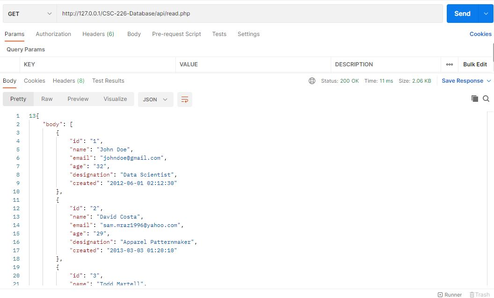
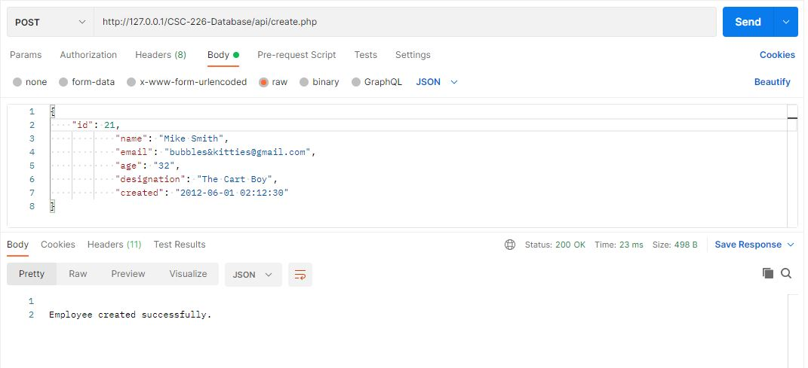
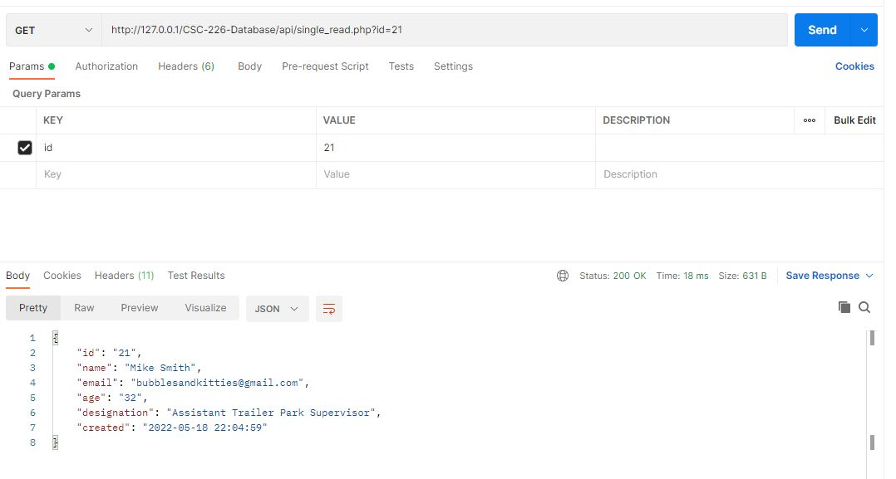
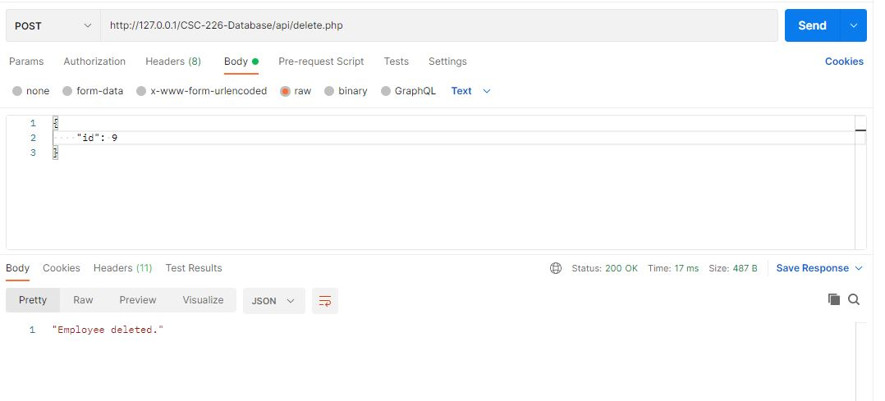
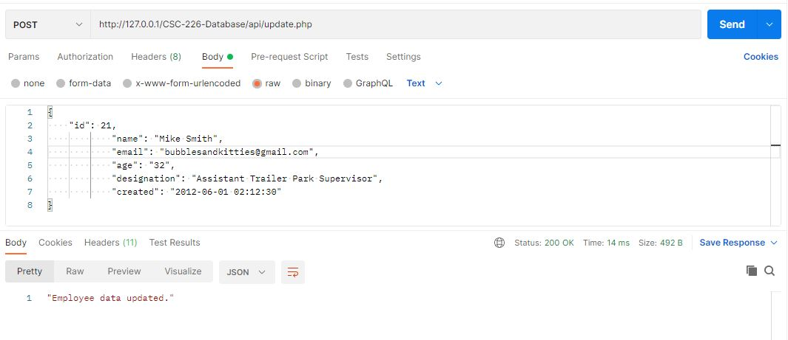

#Welcome to my CSC 226 Repository.
<h1>This is HW #2</h1>

<h3>Below is the READ Request Response</h3>

<h3>Below is the CREATE Request Response</h3>

<h3>Below is the READ-BY-ID Request Response</h3>

<h3>Below is the DELETE Request Response</h3>

<h3>Below is the UPDATE Request Response</h3>

